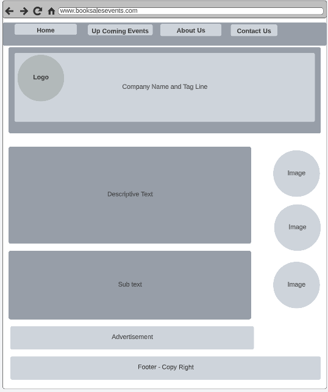
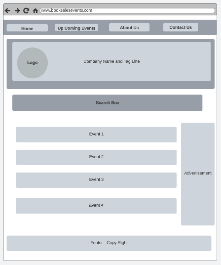
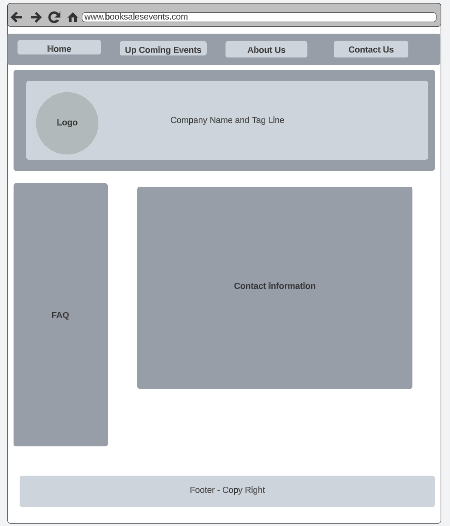

# Ahmed Manzar INF6420 Project

A site to find book sale events

## Wireframes

Site wireframe to present site architecture and layout

Header - will include navigation menu

Sub Header - will include logo and company name, tag line

Navigation Manu - will include link to other pages

Main content - will include what is the site about

Footer - will include copy right 

Header - will include navigation menu

Sub Header - will include logo and company name, tag line

Navigation Manu - will include link to other pages

Search Box - will include option with search button for events by zipcode input

Body will include - list of events in a tabulated format

Footer - will include copy right 

Header - will include navigation menu

Sub Header - will include logo and company name, tag line

Navigation Manu - will include link to other pages

Contact information - will include text with contact details

Footer - will include copy right 

